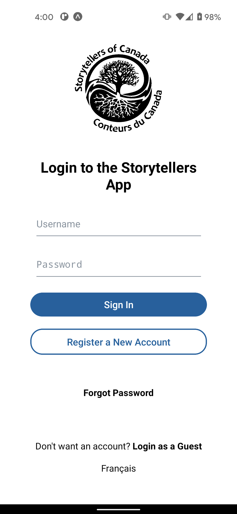
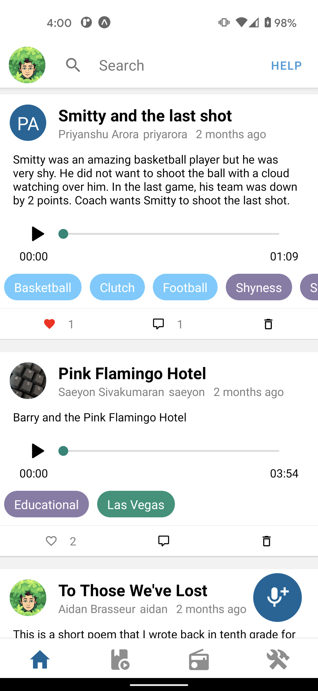
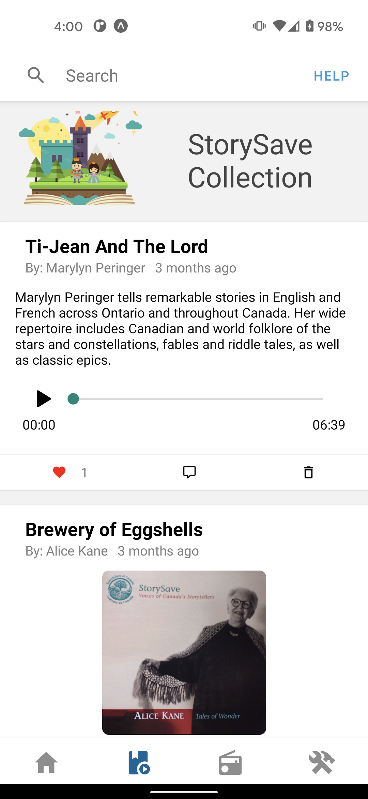
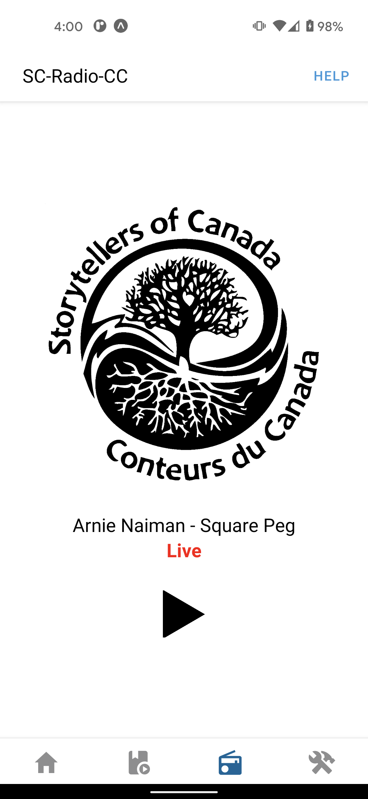

# Storytellers of Canada Application

# Description

We have built a mobile app for Storytellers of Canada that allows storytellers and listeners to share their own stories, respond to other stories with their own story, and listen to the Storytellers of Canada radio station. Users can submit voice recordings of up to 3 minutes in length, including recordings made through the app as well as from other sources. Through this app, we hope to extend the Storytellers of Canada userbase and increase interactivity within the storyteller community. 

The frontend was developed with React Native and TypeScript integrated with the Expo Framework. The API was created using Python and Flask and our data is stored within a MySQL database and S3 storage hosted on DigitalOcean. 

## Instructions
### Getting the app on your phone

**On Android:**

[https://play.google.com/store/apps/details?id=com.StoryTellers.StoryTellersApplication](https://play.google.com/store/apps/details?id=com.StoryTellers.StoryTellersApplication)

**On iOS:**

[https://apps.apple.com/us/app/storytellers-of-canada/id1553962744](https://apps.apple.com/us/app/storytellers-of-canada/id1553962744)

## Screenshots

  
   
   
   

